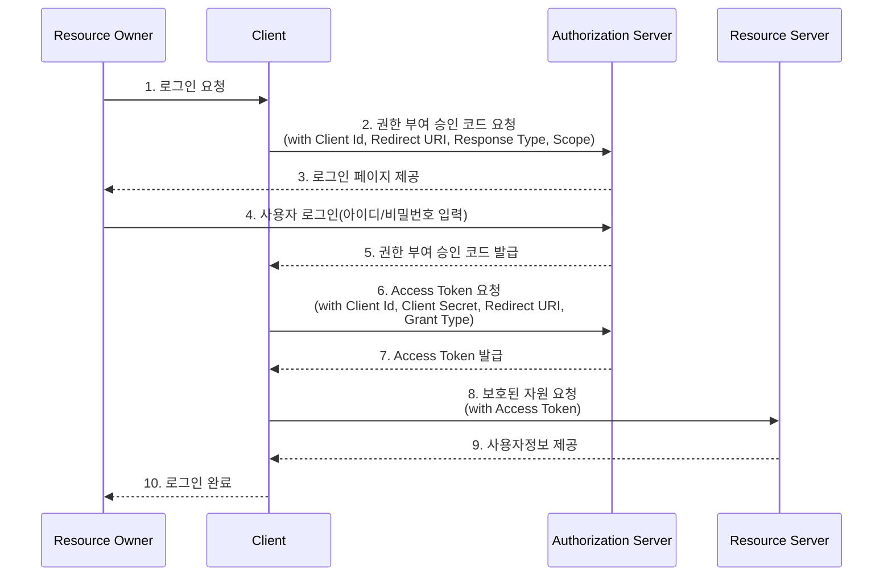

# OAuth2

- OAuth2(Open Authorization 2.0)은 인증을 위한 개방형 표준 프로토콜이다.  
- OAuth2는 Third-Party 애플리케이션(우리가 개발하는 애플리케이션)이 사용자를 대신해서 HTTP 서비스를 이용할 수 있는 권한을 부여하는 메카니즘을 제공한다.
- OAuth2 프로토콜은 사용자의 로그인 정보를 Third-Party 애플리케이션과 공유하지 않고도, 해당 Thrid-Party 애플리케이션이 사용자를 대신해서 특정 작업을 수행하도록 허용한다.
- 이 방식은 사용자의 로그인 정보를 보호하면서, 다양한 애플리케이션과 서비스간의 편리한 연동성을 제공한다.
- OAuth 2.0 프로토콜이 소셜 로그인 시스템에서 널리 사용되는 이유는, Third-Party 애플리케이션을 사용자 이름과 비밀번호 없이 인증하는 매커니즘이 포함되어 있기 때문이다.
즉, OAuth 2.0을 사용하면 사용자는 신뢰할 수 있는 서비스 제공자(Google 또는 Facebook 같은 )를 통해 Third-Party 애플리케이션에 로그인할 수 있다.
이 때, 신뢰할 수 있는 서비스 제공자는 사용자의 신원을 확인(즉, 로그인)하고, 이 정보를 Third-Party 애플리케이션에 전달한다.

## OAuth2의 구성요소

- Resource Owner(자원 소유자)
  - 리소스 소유자다.
  - 웹 서비스를 사용하는 사용자다.
- Client(Third-Party 애플리케이션)
  - 사용자의 리소스에 접근하려는 애플리케이션이다.
  - 이 애플리케이션은 사용자의 명시적인 승인을 통해 사용자의 리소스에 대한 접근 권한을 얻는다.
- Authorization Server(인증 서버)
  - 클라이언트가 사용자의 데이터에 접근할 수 있도록 인증을 제공한다.
  - 사용자의 승인을 받은 클라이언트에게 인증 서버는 Access Token을 발행한다.
- Resource Server(자원 서버)
  - 사용자의 데이터를 제공하는 서버로, 클라이언트가 이 서버를 통해 사용자 데이터에 접근한다.
  - 이 서버는 클라이언트의 요청을 받아 인증 서버로부터 받은 Access Token을 검증하고, 검증을 통과한 요청에 대해 사용자 데이터를 제공한다.

## OAuth2의 처리 흐름

